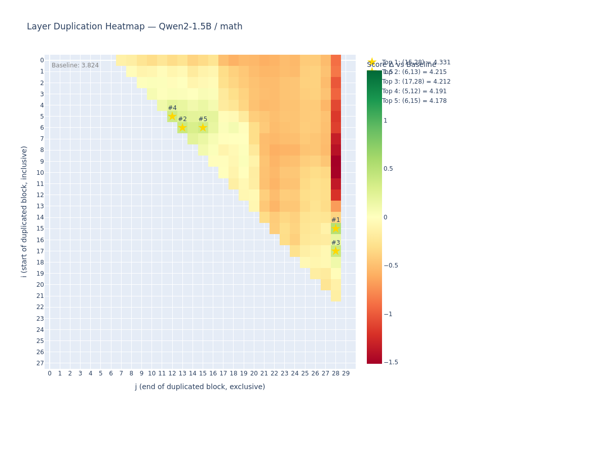

# layer-scan

[](https://pypi.org/project/layer-scan/)
[](https://github.com/XXO47OXX/layer-scan/actions)

Automated LLM layer duplication config scanner — find the optimal (i,j) for any model + task.

Given an open-source LLM and an evaluation probe, `layer-scan` finds the layer duplication config that maximizes model capability without modifying weights.



## Features

- **Full (i,j) scanning** — automated search across all valid configs
- **Logit distribution scoring** — deterministic, no text generation needed
- **Multi-probe analysis** — Pareto-optimal configs across tasks
- **Sparse-then-dense** — two-phase scanning for large models
- **mergekit export** — one-click YAML for mergekit passthrough
- **Cross-tool annotation** — overlay [neuro-scan](https://github.com/XXO47OXX/neuro-scan) labels
- **Interactive heatmaps** — Plotly with hover details

## Install

```bash
pipx install layer-scan
# or
pip install layer-scan

# ExLlamaV2 for 70B+ models:
pip install layer-scan[exllamav2]
```

## Quick Start

```bash
# Scan with math probe
layer-scan scan --model Qwen/Qwen2-7B --probe math

# Scan + export mergekit config
layer-scan scan --model Qwen/Qwen2-7B --probe math --export-mergekit config.yaml

# Multi-probe Pareto analysis
layer-scan multi-probe --model Qwen/Qwen2-7B --probes "math,eq,json"

# Annotate with neuro-scan labels
layer-scan annotate --results results.json --neuro-report report.json

# ExLlamaV2 for large models
layer-scan scan --model /models/qwen2-72b-exl2 --backend exllamav2 --gpu-split "22000,22000"

# Then merge
mergekit-yaml config.yaml ./merged-model --copy-tokenizer
```

## Commands

| Command | Description |
|---------|-------------|
| `scan` | Scan (i,j) configs with a single probe |
| `multi-probe` | Cross-probe scan, Pareto-optimal configs |
| `annotate` | Overlay neuro-scan labels on heatmap |
| `lookup` | Fetch pre-computed results from HF Hub |
| `probes` | List available probes |

## Key Options

| Option | Default | Description |
|--------|---------|-------------|
| `--model`, `-m` | required | Model path or HF ID |
| `--probe`, `-p` | `math` | Probe: math, eq, json, custom |
| `--backend`, `-b` | `transformers` | transformers or exllamav2 |
| `--min-block` | `7` | Min duplicated block size |
| `--top-k`, `-k` | `5` | Top configs to report |
| `--sparse-first` | off | Sparse scan then refine |
| `--export-mergekit` | — | Export as mergekit YAML |

## Probes

| Probe | Samples | Tests |
|-------|---------|-------|
| `math` | 16 | Arithmetic, geometry, calculus |
| `eq` | 12 | Emotions, social cues |
| `json` | 10 | JSON extraction, schema |
| `custom` | variable | Load from JSON file |

## Backends

| Backend | Best for | Multi-GPU |
|---------|----------|-----------|
| `transformers` | Small-medium models | — |
| `exllamav2` | 70B+ quantized | `--gpu-split` |

## References

- [Repeat Yourself: Layer Duplication](https://arxiv.org/abs/2502.01470)
- [SOLAR 10.7B: Depth Up-Scaling](https://arxiv.org/abs/2312.15166)
- [MergeKit](https://github.com/arcee-ai/mergekit)

## License

MIT
